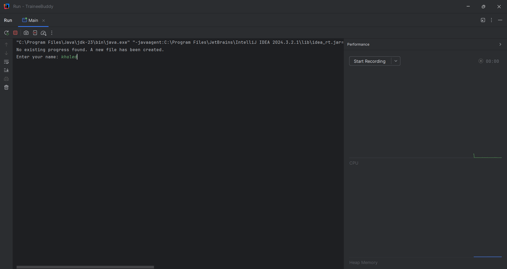
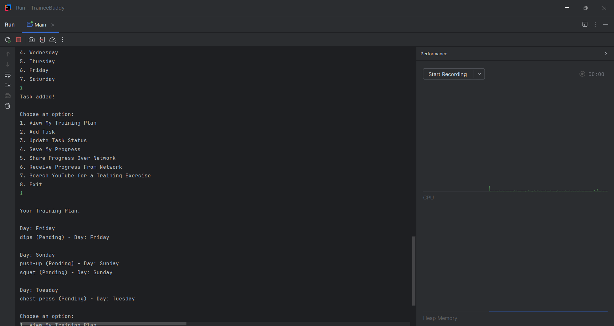
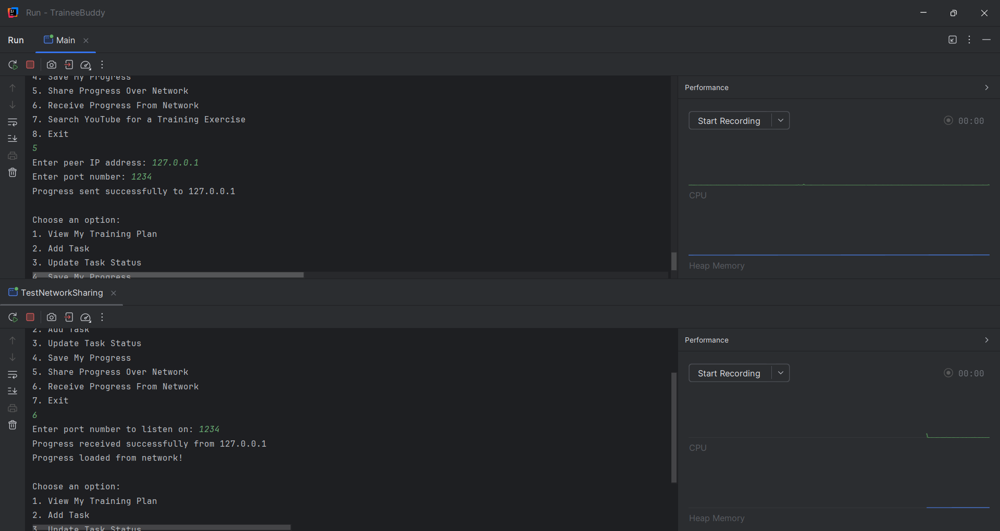
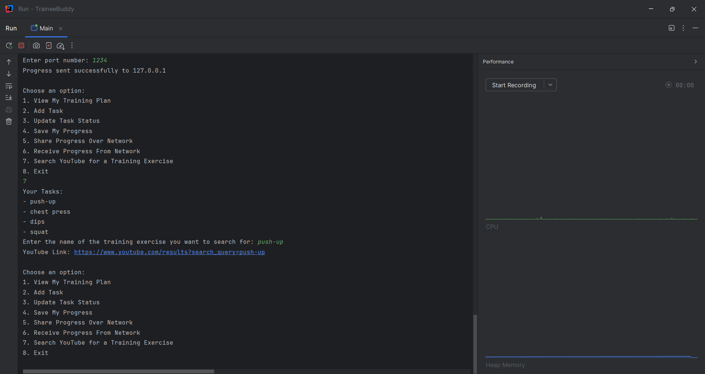

# Training App

## Description
This project is a training management application designed to help users keep track of their training plan and progress. The app allows users to add tasks, update their task statuses, view their training plan, and search for related YouTube videos based on training exercises.

## Features
- View and manage your training plan.
- Add new tasks and assign them to specific days of the week.
- Update the status of tasks (Completed, Pending, Postponed).
- Generate YouTube search links based on training exercises.

## Setup and Installation
1. Clone the repository:
   ```bash
   git clone https://github.com/username/TrainingApp.git
## Screenshots
Here are some screenshots of the app in action:






